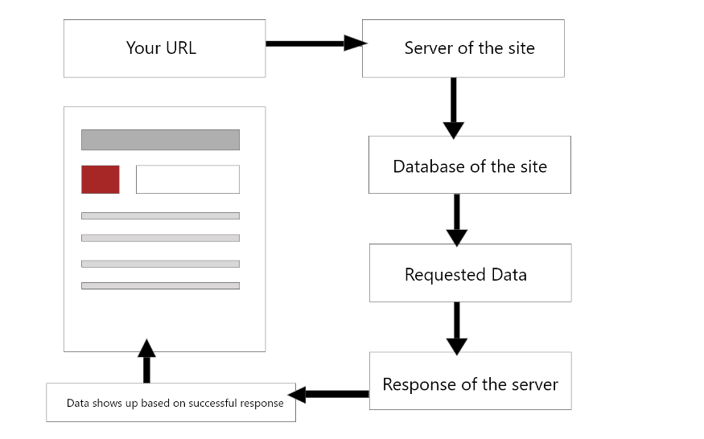

If you are a front-end developer or a beginner in web development and want to learn about REST API this post is for you. I am going to use NodeJS and Express to demonstrate how to work with REST API. I have a tutorial on how to setup a NodeJS Express server [here](https://medium.com/@towfiqu/setting-up-a-nodejs-server-a58ae1615481). In case you don't know how to setup a NodeJS server; follow that one first and setup your server and come back.

<br>

Just to clear some things up you can use REST API to communicate with any external third party API and build some cool front-end project. At the end of the day they are just like any other http request you send everyday on your browser URL bar, whether it's Facebook, Twitter or any other site that is connected to a database.

<br>

The flow works like this.



<br>

To start there are four common actions you can take with REST API to interact with another application. They are

<br>

- **POST** Request
- **GET** Request
- **PUT** Request
- **DELETE** Request

<br>

Also knows as CRUD operation. Create, Read, Update and Delete.

<br>

### POST Request

<br>

In a simplest term A **POST** Request is when someone send a request to add new data to the database or there is a need of data validation in order to get something. Like signing up or signing in to a site.

<br>

Let's see how you will implement this using NodeJS and Express. By now you should have a node server running. For the purpose of this demo I am going to use some mock data to mimic a database.

<br>

```js
const express = require("express")

const app = express()

app.listen(5000, () => {
  console.log("Server started on PORT 5000")
})

const mockData = [
  {
    id: "1",
    name: "Chelsea",
    country: "England",
    league: "EPL",
  },
  {
    id: "2",
    name: "Real Madrid",
    country: "Spain",
    league: "La Liga",
  },
]
app.post("/add_team", (req, res) => {
  // Our Request
  mockData.push({
    id: "3", // equivalent to (req.body.id)
    name: "Barcelona", // equivalent to (req.body.name)
    country: "Spain", // equivalent to (req.body.country)
    league: "La Liga", // equivalent to (req.body.league)
  })
  // this is the response from our request
  res.send(mockData)
})
```

<br>

Express comes with handy utility methods like post, get, put, delete and many more. You can check their [documentation](https://expressjs.com/) for full list of supported methods. In app.post() The first argument is the route path which we have to include at the end of our URL, in this case <http://localhost:5000/add_team> and the second one is a callback function which takes two parameters request and response. Shortened version (req, res). This callback function is where we write all of our logic. Things like what to send in a request, and what to do when we get a response. How to handle errors. I am not going to cover error handling in this post since I am trying to keep things introductory here, but keep that on the back of your mind.

<br>

Now the callback function comes with their own methods attached with req, res. As I said earlier you can add data to your request body. Here I am adding a new object to my mockData array. In real app this **POST** Request will add this data to the database which will have these fields (id, name, country, league).

<br>

You can test the above code by sending a POST request. Now you cannot send a **POST** Request in a browser URL. But you can use an API testing extension like postman or RESTED. I am not explaining how to use these extension they are pretty self-explanatory. Install one of these and select POST from request tab of the extension, in the URL tab paste this <http://localhost:5000/add_team> and hit send you will see it returns a new array with 3 items. Last one is the object we put in our **POST** Request.

<br>

At the last line of our above code "res.send(mockData)" is responsible for that 3 array return. Which is also the response we are expecting from that request.

<br>

This is how basically all of these http methods going to work. We call the http methods with (app.name_of_the_request) give it our route path, setup our callback function with (req, res) and write our logic inside of it. And at the end in "res.send()" we put our expected result.

<br>
Let's see rest of these methods.

<br>

<br>

### GET Request

<br>

HTTP **GET** Request is exactly what it sounds like it gets the data from the database. You can't add new data with **GET** Request. You can get data based on your specific query. Let's say from above mockData you want to get the information of team which has id 2. This is how that request will look.

<br>

```js
app.get("/:id", (req, res) => {
  mockData.map(team => {
    if (team.id === req.params.id) {
      // confused??
      res.send(team)
    }
  })
})
```

<br>

"req.params" comes with all these requests. There are three common request methods you are probably going to use most days. "req.body" which we saw in **POST** Request, other two "req.params" and "req.query".

<br>

If we want to use req.params we have to add the parameters at the end of our route path which we did by prefixing it with colon, and then to access that parameter we use (req.params.name_of_parameter). On the next example we will see the use of "req.query". Other than that everything else is same as what you saw in the example of **POST** Request. Now you can test this same way you did before or this time you can actually use your browser URL. Since browser URL accepts **GET** Request you won't have any problem.

<br>

By now you have noticed there is a difference in our route path apart from request parameter. This time we have just put a '/' instead of something descriptive. '/' this represents your root path, so if you just put <http://localhost:5000/1> we will see our expected result in the browser. Try it.

<br>

At any point if you get any errors make sure your Node server is running.

<br>

### PUT Request

<br>

Whenever we want to update existing data in our database we send HTTP **PUT** Request. Now this can be done with **POST** Request too. But this is a preferred method to update your existing data. Let's see how that looks in code this time with "req.query".

<br>

```js
app.put("/update_team", (req, res) => {
  mockData.map(team => {
    if (team.id === req.query.id) {
      // req.query
      team.name = "Liverpool"
    }
  })
  res.send(mockData)
})
```

<br>

Almost everything is similar. We just change the route path, and to update the team name we are using "req.query". How do we use that "req.query"? In "req.params" we pass the parameter in the route path. Here we do something almost similar but this time in our main URL <http://localhost:5000/update_team?id=1> prefixing the query (id) with a Question mark and then putting the value after an equal sign.

<br>

By now you should see that there is a pattern to this. for **POST** Request our method is app.post(), for **GET** Request app.get() and so on.

<br>

Before we cap off let's also use the **Delete** Request to delete one of our items from the array.

<br>

### Delete Request

<br>

```js
app.delete("/delete_team/:id", (req, res) => {
  var teamIndex = mockData.findIndex(team => team.id === req.params.id)
  mockData.splice(teamIndex, 1)
  res.send(mockData)
})
```

<br>

As you can see there isn't much of a difference. We are just using app.delete() and "req.params" to select the item of deletion. And few lines of JavaScript to delete an item from array. Run this URL <http://localhost:5000/delete_team/1> by setting your request tab to delete on your API testing extension and you should see it returns only one item after delete which is expected.

<br>

And that's it. After this you should have a basic working knowledge of REST API. Here is the full code.

<br>

```js
const express = require("express")

const app = express()

app.listen(5000, () => {
  console.log("Server started on PORT 5000")
})

const mockData = [
  {
    id: "1",
    name: "Chelsea",
    country: "England",
    league: "EPL",
  },
  {
    id: "2",
    name: "Real Madrid",
    country: "Spain",
    league: "La Liga",
  },
]
app.get("/:id", (req, res) => {
  mockData.map(team => {
    if (team.id === req.params.id) {
      res.send(team)
    }
  })
})

app.post("/add_team", (req, res) => {
  mockData.push({
    id: "3",
    name: "Barcelona",
    country: "Spain",
    league: "La Liga",
  })
  res.send(mockData)
})

app.put("/update_team", (req, res) => {
  mockData.map(team => {
    if (team.id === req.query.id) {
      team.name = "Liverpool"
    }
  })
  res.send(mockData)
})

app.delete("/delete_team/:id", (req, res) => {
  var teamIndex = mockData.findIndex(team => team.id === req.params.id)
  mockData.splice(teamIndex, 1)
  res.send(mockData)
})
```
