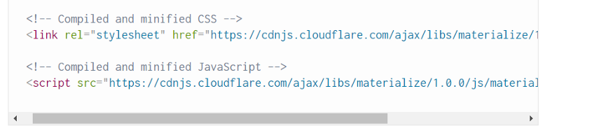
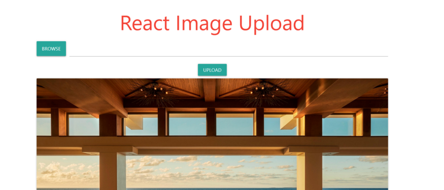
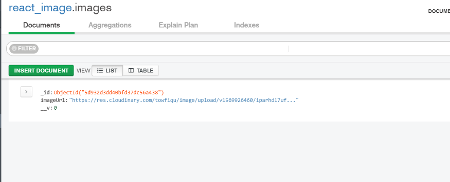

<br>

In this tutorial we are going to upload images in MongoDB with NodeJS and React. And we are going to use Cloudinary to store the images.

<br>

Setup a Cloudinary Account if you don’t have one already. It’s free. Locate the “API Base URL” in your Dashboard. And then locate “Upload presets” which you will find in the settings -> upload. You will see the option “Upload presets” in the bottom. Unlock the Unsigned preset. We will need the name. (for our purposes unsigned preset will do just fine)

<br>

I am assuming you already have basic knowledge about React, Node and MongoDB. Let’s get started.

<br>

These are the things that we are going to need to achieve our goal.

<br>

1. NodeJS, Express Server.

2. MongoDB compass.

3. Create-react-app.

4. Materialize CSS (Optional). Although I am going to use it for little bit of designing in the front-end.

<br>

NPM packages that needs to be installed.

<br>

1. express

2. mongoose

3. cors

4. axios (we will use axios in client side to send api request)

<br>

Also, setup a create-react-app project in case you haven’t done it already.

<br>

Here, I will briefly describe how I am going to implement the whole thing. Make sure you understand the flow of my development process. You will be able to follow the rest of the article with much more ease and make sense of things much better.

<br>

I am going to create an express server with NodeJS. Then I will create a mongoose schema to store the image URL that will be coming from Cloudinary. Okay, this probably needs a little bit more explanation. The way it’s going to work is you will upload an image from the file input in the browser then that image will go to your Cloudinary storage through the API that is given to you by Cloudinary. If your image is successfully received by Cloudinary it will give you an URL of that image in response. Then you will send a POST request with that image URL to your MongoDB database to store the image URL. Optionally I will also create a GET request in order for us to retrieve those images from our database later. And that’s pretty much it.

<br>

Now, let’s setup a NodeJS server with express. You already should have these two installed on your local machine. This is how the setup looks typically.

<br>

```js
const mongoose = require("mongoose")
const express = require("express")
const cors = require("cors")

const app = express()
app.use(cors())
app.use(express.json())

app.listen(3000, () => {
  console.log("Server Started on Port 3000 ....")
})

app.get("/", (req, res) => {
  res.send("Testing 123")
})
```

<br>

We are going to be using mongoose to create our schema for the database. Also, check to see if server is running properly.

<br>

Next, we are going to create database schema to store the image URL that will be coming from the Cloudinary. Before doing that, we just need to setup our local MongoDB with the server. Here is a screenshot of that.

<br>

```js
const db = "mongodb://localhost/react_image"
mongoose
  .connect(db, {
    useNewUrlParser: true,
    useUnifiedTopology: true,
  })
  .then(() => {
    console.log("Connected to MongoDB ...")
  })
  .catch(err => {
    console.error("Could not Connect to MongoDb !!!", err)
  })
```

<br>

Our database model/schema is very simple with just one field “imageUrl” to save the image URL.

<br>

```js
const Image = mongoose.model(
  "image",
  mongoose.Schema({
    imageUrl: String,
  })
)
```

<br>

Let’s create the two api endpoints that we will use to communicate with our database.

<br>

We will use a POST request with /upload endpoint that will send the Image URL to the database. We will only be able to do that if we successfully upload an image to Cloudinary. Also, a GET request with /getLatest endpoint to get the latest image URL.

<br>

```js
app.post("/upload", async (req, res) => {
  try {
    const newImage = new Image({
      imageUrl: req.body.imageUrl,
    })
    await newImage.save()
    res.json(newImage.imageUrl)
  } catch (err) {
    console.error("Something went wrong", err)
  }
})

app.get("/getLatest", async (req, res) => {
  const getImage = await Image.findOne().sort({ _id: -1 })
  res.json(getImage.imageUrl)
})
```

<br>

That’s it for the backend. Let’s get to the meat of this tutorial. Sending image to Cloudinary and getting back the URL, and then sending the request to the server to save it to database.

<br>

Before implementing the code to send request to Cloudinary, we need to setup our front-end UI to take the image input and then display it to our web page. In your create-react-app project folder go to public/index.html and add materialize/CSS stylesheet to the head of your html and script file into the body of your html. You will find the link [here](https://materializecss.com/getting-started.html).

<br>



<br>

Our UI is going to be very simple. It will have a Header, File input form, an upload button and simple card to display the image.

<br>



<br>

Remember, I told you earlier to locate the Cloudinary “API Base URL” and “Upload presets”. We are going to need them now. Copy the “API Base URL” and “Upload presets name” into your App.js and save them to separate variables. You can obviously not do that and just use the API and name directly, but I will recommend otherwise since it’s a good coding practice to store them in some variables, so you can change them later easily if it’s required.

<br>

```js
import React, { useState, useEffect } from "react"
import axios from "axios"
import loadingGif from "./spinner.gif"

const url = "your API Base URL"
const preset = "your Upload presets"
```

<br>

By the way, don’t forget to add /image/upload after the API URL.

<br>

Let’s also setup the file input form in App.js. I just pulled the default “file input form” code from materialize/CSS documentation and called it a day. Check the documentation and look for form and then file input form.

<br>

```js
return (
    <div className='container'>
      <h1 className='center red-text'>React Image Upload</h1>
      <div className='file-field input-field'>
        <div className='btn'>
          <span>Browse</span>
          <input type='file' name='image' onChange={onChange} />
        </div>
        <div className='file-path-wrapper'>
          <input className='file-path validate' type='text' />
        </div>
      </div>
```

<br>

Now that we have an input form to get the image from our files let’s also see how react will handle that upcoming image. The onChange method will handle the image. To store the image in a variable we are going to use React hooks. If you don’t know what that is, you should check that first.

<br>

```js
const [image, setImage] = useState("")
const [loading, setLoading] = useState(false)
const onChange = e => {
  setImage(e.target.files[0])
}
```

<br>

You can ignore second line. That’s just something I used to add a spinner while the image is being brought from the database.

<br>

```js
<div className="center">
  <button onClick={onSubmit} className="btn center">
    upload
  </button>
</div>
```

<br>

Next, we will submit that image to Cloudinary with an upload button and onClick={onSubmit} method. This is where most of our important codes will go. You can call it the engine room of our little app. To upload an image, we need to send it as a form data. So, first we create a JavaScript formData then we append our image to it with formData.append() method. The method takes a key value pair. Notice that in first append() our key is ‘file’ and value is our image, and in the second key is ‘upload_preset’ value is ‘’upload preset name’’ that we got from the Cloudinary. These keys are required by Cloudinary so, they must match exactly with the syntax above otherwise your upload will be failed.

<br>

I will put the code snippet now, so you can check yours with mine and then I will continue explaining rest of the code.

<br>

```js
const onSubmit = async () => {
  const formData = new FormData()
  formData.append("file", image)
  formData.append("upload_preset", preset)
  try {
    setLoading(true)
    const res = await axios.post(url, formData)
    const imageUrl = res.data.secure_url
    const image = await axios.post("http://localhost:3000/upload", {
      imageUrl,
    })
    setLoading(false)
    setImage(image.data)
  } catch (err) {
    console.error(err)
  }
}
```

<br>

Next, we will send a POST request to our Cloudinary API and if it succeeds, we will get an image URL. We save the image URL in a variable and then send another POST request to our server with that image URL to save the it in our MongoDB database. The second POST request will give us the image URL database just stored for us, and we set it as our new Image with setImage() to display in the web page. Check the MongoDB compass to see if image URL was stored properly.

<br>



<br>

I also have an API endpoint with GET request to get the latest image for the next time you load the page. Or whenever you visit the site for the first time it will look for an image in the Database but, that’s optional.

<br>

I will add the code just for sake of the completion.

<br>

```js
useEffect(() => {
  async function fetchImage() {
    const image = await axios.get("http://localhost:3000/getLatest")
    setImage(image.data)
  }
  fetchImage()
  // eslint-disable-next-line
}, [])
```

<br>

And that’s it. You have successfully built a full stack image app on your own.
