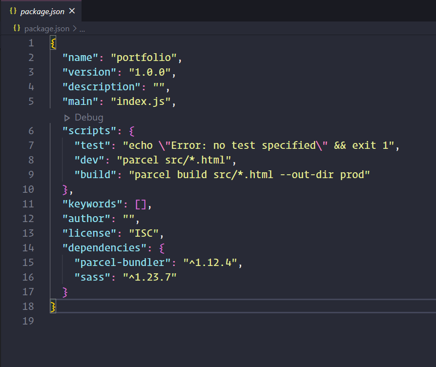

You have made a cool site with html, CSS & JavaScript, and you have seen how easy it is to host on [Netlify](https://www.netlify.com/) And you have done that too. But there is a slight little issue. Your website showing these ugly .html extension at the end of your URL.

<br>

```bash
mysite.com/index.html
```

<br>

Not so cool now _is it_.

<br>

Like everything else in Netlify there is an easy fix for this too. By the way, this is not a sponsored post; in case you were wondering. I just like their service. Let's get to it.

<br>

My understanding is you already have a site on Netlify. So, I will just jump into the phase where you will be removing the .html extension.

<br>

1. Create a "\_redirects" file on your root directory. Where **index.html** lives. I am assuming here; you could have a different structure. Main thing here is your root directory.

<br>

2. Go to your package.json file and make sure in your **scripts** you have selected all the **html file** during build. Not just **index.html**. This will allow you to remove .html from all the **html files** not just **index.html**. Check the following screenshot for reference.

<br>



<br>

3. Open your "\_redirects" file, and for all the **html files** that you have, write this.

<br>

```bash
# for root
/*				/index.html		200

# for the rest
/about/*		/about.html		200
/contact/*		/contact.html	200

```

<br>

This will rewrite your path. Each lines matter in "\_redirects" file. They are for separate commands. Indentation for decoration.

<br>

First, you put the route name you want to give. "**\***" means all the routes with same signature will open same **html file**. Then, the **html file** you want to associate with that route. The last one is **http status code** **200**. In this case, it says you want to rewrite your path with the route name you have given.

<br>

4. Now change the **route** inside all of your **html link** based on the **route** name you gave them in your "\_redirects" file.

<br>

Example: If you have an **about.html** link inside your **index.html** you change that to **/about/**

<br>

That's it. Do that for all of your link and update your site. You won't see those dreaded .html extension any more.
